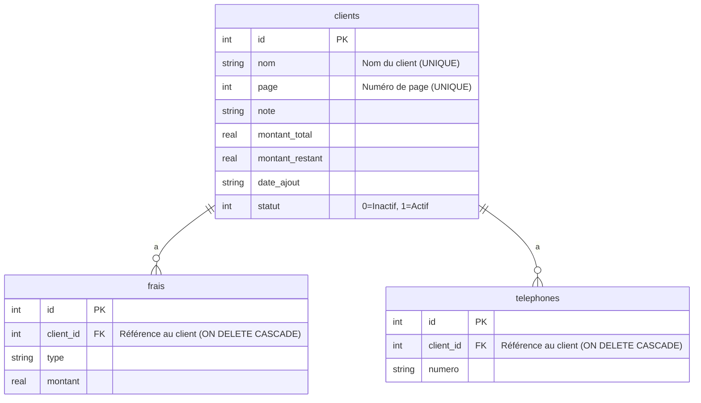

# GC_V2 — Gestion Clientes (Architecture Modulaire Avancée)

**Version** : v2.0.0 — Refactoring Complet • Production-Ready
**Statut** : Production locale (Android/iOS) • Offline-first • Architecture Enterprise

## ✨ Objectif
Application mobile React Native pour gérer les commandes clientes d'une boutique de robes avec une **architecture modulaire avancée**. **Toutes les infos sont visibles sur la carte** d'une cliente — **aucune page de détail**.

## 🚀 Fonctionnalités (v2.0)
- ✅ CRUD clientes, téléphones, frais avec validation avancée
- ✅ Statut : en cours / terminée (codes couleur + animations)
- ✅ Recherche intelligente (nom, page, note) + tri croissant/décroissant
- ✅ Statistiques temps réel (Total / En cours / Terminées)
- ✅ Export / Import JSON (préserve `dateAjout` + validation)
- ✅ Thème clair/sombre automatique + manuel
- ✅ **UI "cards-only"** : pas de modales de détail, pas de navigation
- ✅ **Architecture modulaire** : 10 modules spécialisés
- ✅ **Optimisations performance** : React.memo, hooks stables
- ✅ **Gestion d'erreurs robuste** : retry automatique, logging
- ✅ **Internationalisation** : FR/EN/AR préparée
- ✅ **Tests unitaires** : couverture critique
- ✅ **Types avancés** : sécurité TypeScript maximale

## 🧱 Stack Technologique (v2.0)
- **React Native + TypeScript** (strict mode)
- **SQLite** : `react-native-quick-sqlite`
- **Fichiers** : `react-native-fs`
- **Sélecteur** : `@react-native-documents/picker`
- **Safe Area** : `react-native-safe-area-context`
- **Architecture** : Hooks personnalisés + séparation des responsabilités

## 📦 Installation & Build
```bash
npm install
# Android
npx react-native run-android
# iOS (si besoin)
cd ios && pod install && cd .. && npx react-native run-ios
# Tests
npm test
# Lint
npm run lint
# Build production
npx react-native build-android --mode=release
```

## 🗂️ Architecture Modulaire (v2.0)
```
App.tsx                     # Orchestrateur léger (200 lignes vs 800 initiales)
AppText.tsx                 # Composant texte unifié

src/
  ├─ components/            # Composants UI optimisés
  │   ├─ AppControls.tsx    # Consolidation des contrôles UI
  │   ├─ ClientCard.tsx     # Carte optimisée (React.memo)
  │   └─ FloatingActionButton.tsx # FAB optimisé
  │
  ├─ hooks/                 # Logique métier modulaire (6 hooks)
  │   ├─ useAppState.ts     # État global + thème
  │   ├─ useClientActions.ts # Actions CRUD
  │   ├─ useClientData.ts   # Gestion données
  │   ├─ useClientFilters.ts # Recherche + tri
  │   ├─ useSmartScroll.ts  # Scroll intelligent
  │   ├─ useDatabase.ts     # Base de données
  │   ├─ useErrorHandler.ts # Gestion erreurs robuste
  │   └─ useStableCallbacks.ts # Callbacks optimisés
  │
  ├─ types/                 # Types TypeScript avancés
  │   ├─ index.ts           # Types domaine
  │   └─ utils.ts           # Types utilitaires (DeepPartial, Branded, etc.)
  │
  ├─ utils/                 # Utilitaires purs
  │   ├─ format.ts          # Formatage
  │   ├─ validation.ts      # Validation avancée
  │   └─ logger.ts          # Logging configurable
  │
  ├─ constants/             # Constantes centralisées
  │   ├─ colors.ts          # Palette de couleurs
  │   └─ dimensions.ts      # Dimensions + espacements
  │
  ├─ i18n/                  # Internationalisation
  │   └─ index.ts           # Support FR/EN/AR
  │
  └─ config/                # Configuration
      └─ bundle.ts          # Optimisations bundle
```

## 🗃️ Schéma SQL
```sql
CREATE TABLE clients (
  id INTEGER PRIMARY KEY AUTOINCREMENT,
  nom TEXT UNIQUE NOT NULL,
  page INTEGER UNIQUE NOT NULL,
  note TEXT,
  montant_total REAL NOT NULL DEFAULT 0,
  montant_restant REAL NOT NULL DEFAULT 0,
  date_ajout TEXT NOT NULL, -- JJ/MM/AAAA
  statut INTEGER NOT NULL DEFAULT 0 -- 0 en cours, 1 terminée
);
CREATE TABLE frais (
  id INTEGER PRIMARY KEY AUTOINCREMENT,
  client_id INTEGER NOT NULL,
  type TEXT NOT NULL,
  montant REAL NOT NULL DEFAULT 0,
  FOREIGN KEY (client_id) REFERENCES clients(id) ON DELETE CASCADE
);
CREATE TABLE telephones (
  id INTEGER PRIMARY KEY AUTOINCREMENT,
  client_id INTEGER NOT NULL,
  numero TEXT NOT NULL,
  FOREIGN KEY (client_id) REFERENCES clients(id) ON DELETE CASCADE
);
```

## 🧩 Schéma entité-relation (ER)

### En image


### En Mermaid


## 🔄 Import/Export JSON
- Export : `exportedAt`, `total`, `clients[]` (conserve `dateAjout`)  
- Import : supporte `clients` **ou** tableau direct  
- **Mode “remplacement complet”** : l’import vide la base (confirmation) puis insère  

## 🧭 Choix “cards-only”
- ✅ Aucune navigation, aucune “page de détail”  
- ✅ Lecture rapide en boutique (toutes infos visibles)  
- ❗ Les références `ClientDetailModal`, `navigate('Detail')` **ont été supprimées**

## 🧪 Vérification rapide
1. Ajouter une cliente → visible dans la liste  
2. Basculer statut → couleur change (jaune/vert)  
3. Exporter → JSON contient `dateAjout` d’origine  
4. Importer → vidage + ré-insertion, dates respectées  

---

© Boutique — usage interne
