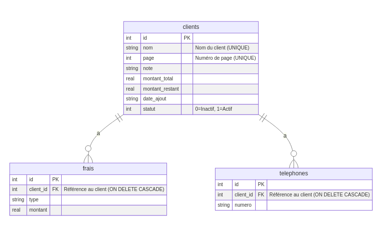
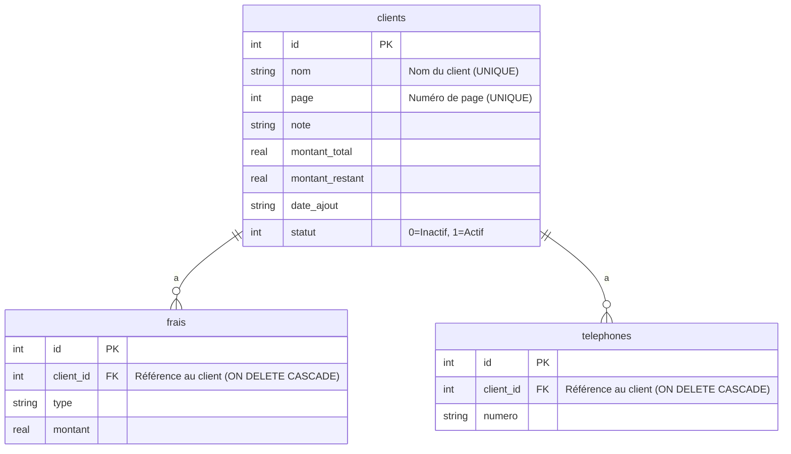

# GC_V2 — Gestion Clientes (UI “cards-only”)

**Version** : v1.3.0 — Cards-only UI stable  
**Statut** : Production locale (Android) • Offline-first

## ✨ Objectif
Application mobile React Native pour gérer les commandes clientes d’une boutique de robes. **Toutes les infos sont visibles sur la carte** d’une cliente — **aucune page de détail**.

## 🚀 Fonctionnalités
- CRUD clientes, téléphones, frais  
- Statut : en cours / terminée (codes couleur)  
- Recherche (nom, page, note) + tri croissant/décroissant  
- Statistiques (Total / En cours / Terminées)  
- Export / Import JSON (préserve `dateAjout`)  
- Thème clair/sombre  
- **UI “cards-only”** : pas de modales de détail, pas de navigation  

## 🧱 Stack
- React Native + TypeScript  
- SQLite : `react-native-quick-sqlite`  
- Fichiers : `react-native-fs`  
- Sélecteur : `@react-native-documents/picker`  
- Safe Area : `react-native-safe-area-context`

## 📦 Installation
```bash
npm install
# Android
npx react-native run-android
# iOS (si besoin)
cd ios && pod install && cd .. && npx react-native run-ios
```

## 🗂️ Structure (principale)
```
App.tsx                     # Orchestrateur (logique, FlatList, formulaires)
AppText.tsx                 # Texte commun
src/
  components/
    ClientCard.tsx          # Carte cliente (toutes les infos)
    SearchBar.tsx           # Barre de recherche
    Stats.tsx               # 3 compteurs + filtres
    DataActions.tsx         # Export / Import
    ThemeToggle.tsx         # Switch thème
    SortButton.tsx          # Tri
  types/index.ts            # Types TS
  utils/format.ts           # Fonctions pures (formatage, normalisation)
```

## 🗃️ Schéma SQL
```sql
CREATE TABLE clients (
  id INTEGER PRIMARY KEY AUTOINCREMENT,
  nom TEXT UNIQUE NOT NULL,
  page INTEGER UNIQUE NOT NULL,
  note TEXT,
  montant_total REAL NOT NULL DEFAULT 0,
  montant_restant REAL NOT NULL DEFAULT 0,
  date_ajout TEXT NOT NULL, -- JJ/MM/AAAA
  statut INTEGER NOT NULL DEFAULT 0 -- 0 en cours, 1 terminée
);
CREATE TABLE frais (
  id INTEGER PRIMARY KEY AUTOINCREMENT,
  client_id INTEGER NOT NULL,
  type TEXT NOT NULL,
  montant REAL NOT NULL DEFAULT 0,
  FOREIGN KEY (client_id) REFERENCES clients(id) ON DELETE CASCADE
);
CREATE TABLE telephones (
  id INTEGER PRIMARY KEY AUTOINCREMENT,
  client_id INTEGER NOT NULL,
  numero TEXT NOT NULL,
  FOREIGN KEY (client_id) REFERENCES clients(id) ON DELETE CASCADE
);
```

## 🧩 Schéma entité-relation (ER)

### En image


### En Mermaid


## 🔄 Import/Export JSON
- Export : `exportedAt`, `total`, `clients[]` (conserve `dateAjout`)  
- Import : supporte `clients` **ou** tableau direct  
- **Mode “remplacement complet”** : l’import vide la base (confirmation) puis insère  

## 🧭 Choix “cards-only”
- ✅ Aucune navigation, aucune “page de détail”  
- ✅ Lecture rapide en boutique (toutes infos visibles)  
- ❗ Les références `ClientDetailModal`, `navigate('Detail')` **ont été supprimées**

## 🧪 Vérification rapide
1. Ajouter une cliente → visible dans la liste  
2. Basculer statut → couleur change (jaune/vert)  
3. Exporter → JSON contient `dateAjout` d’origine  
4. Importer → vidage + ré-insertion, dates respectées  

---

© Boutique — usage interne
